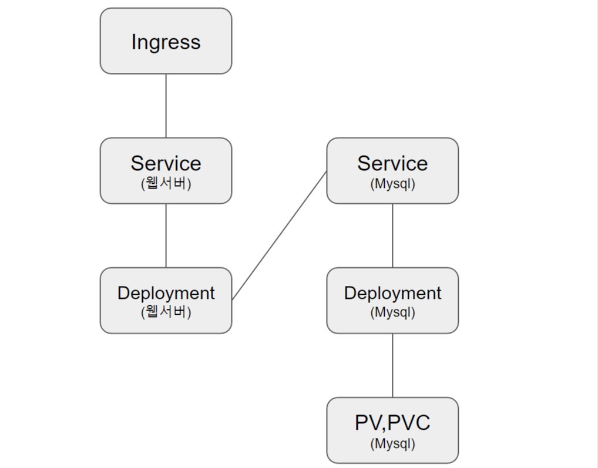

# 구름톤 트레이닝 실습 과제 2

---

구름톤 실습 과제2 제출 레포지토리입니다.

## * 과제 개요

---

> 아래 이미지의 구조를 구성하는 manifest 생성 및 적용



* Kubernetes 서비스 구성에 대한 yaml 파일은 프로젝트 Root 경로의 **[deploy]** 폴더에 위치해있습니다.

## * 실행 순서

---
> 실행 테스트는  GKE 환경에서 진행하였습니다. <br>
> 별도의 환경에서는 Ingress Controller 설치가 필요할 수 있으니 참고 바랍니다.

<br>

### 1. 네임스페이스 생성
```bash
kubectl create ns goorm
```
<br>

### 2. SVC 생성
* NodePort 로 Backend 80 Port, Mysql은 내부 DNS 를 이용한 연결
```bash
kubectl apply -f deploy/re-svc.yaml
```
<br>

### 3. Ingress 생성
* GKE 외부 부하분산기를 사용하였습니다. <br>
* loadbalancer-controller <-> ingress <-> pod
```bash
kubectl apply -f deploy/re-ingress.yaml
```
<br>

### 4. StorageClass 생성
* 동적 프로비저닝을 위한 스토리지 클래스 생성
```bash
kubectl apply -f deploy/re-storage.yaml
```
<br>

### 5. PVC 생성
* mysql 용 pvc 생성
```bash
kubectl apply -f deploy/re-pvc.yaml
```
<br>

### 5-1. Node Name (Optional)
* 한 개의 노드로만 PV 를 연결하기 위해서 MySQL를 배치할 Node에 Label을 달아 NodeSelector를 이용한다.
```bash
kubectl get nodes
```
```bash
kubectl label {node-name} app=database-node
```
<br>

### 6. ConfigMap, Secret 생성
* Database 연결을 위한 환경변수를 담은 ConfigMap, Secret 설정입니다.
```bash
kubectl apply -f deploy/re-secret.yaml

kubectl apply -f deploy/re-config-map.yaml
```
<br>


### 8. Deployment 생성
```bash
kubectl apply -f deploy/re-deploy.yaml
```